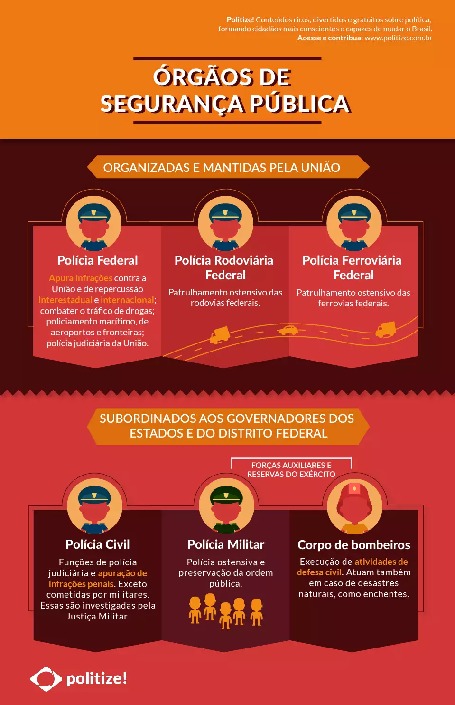
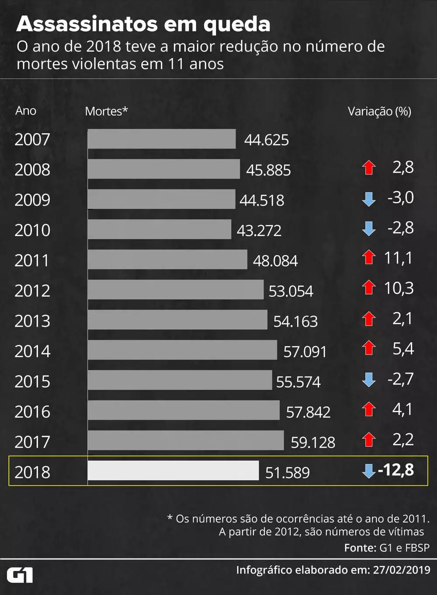
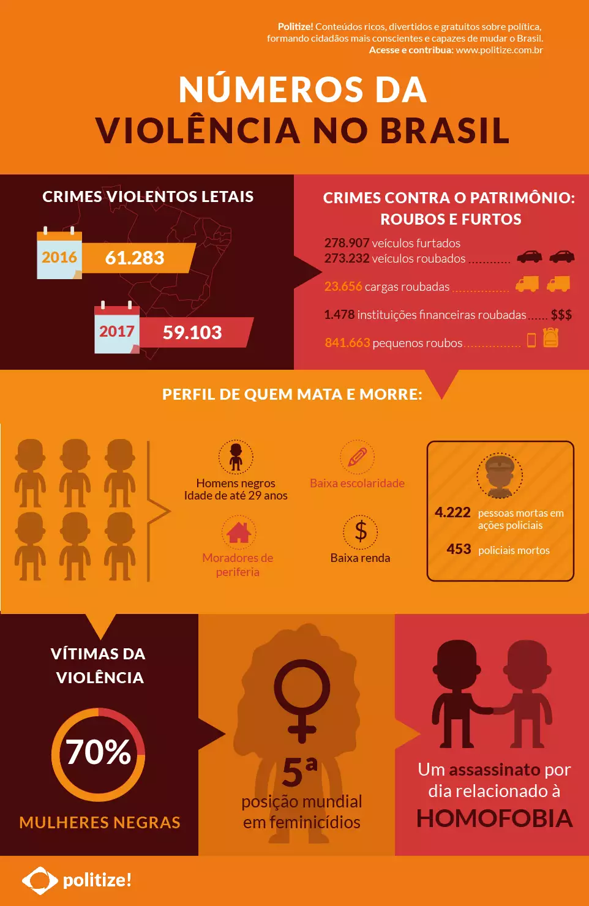

Vivemos uma transformação acelerada no mercado de
trabalho. Com o avanço da inteligência artificial e da automação,
muitas funções tradicionais estão sendo eliminadas ou
substituídas em todo o mundo. Funções que representavam
15,4% da força de trabalho global em 2020 encolherão para 9%
até 2025. Por outro lado, a participação das novas profissões
(como especialistas em dados e inteligência artificial) quase
dobrará, crescendo de 7,8% para 13,5% da base total de
empregados no mesmo período. Milhões de vagas em todo o
mundo estão deixando de ser preenchidas, ao mesmo tempo em
que um contingente cada vez maior de indivíduos não encontra
mais colocação no mercado de trabalho.
Cinco em cada dez brasileiros acreditam que a automação
vai tornar seus empregos obsoletos nos próximos dez anos,
enquanto nove estão preocupados com sua requalificação.
Praticamente todos, porém, veem a chegada de novas tecnologias
como oportunidade para usá-las ou entendê-las melhor.
Trata-se de um momento de grandes ameaças e grandes
oportunidades, que exige investimentos urgentes na formação
digital da atual força de trabalho e das gerações futuras. É preciso
dar a todos a oportunidade de adquirir novas competências tanto
para assegurar sua empregabilidade quanto para aproveitar as
oportunidades que se abrem no mercado e impulsionar o
crescimento do nosso país.

A palavra “metaverso”, formada pelo acréscimo do
prefixo grego meta (além) à forma abreviada do vocábulo
“universo”, foi popularizada pelo escritor norte-americano Neal
Stephenson, em seu livro de ficção científica Nevasca (2008) ou,
no original, Snow Crash (1992).
Inicialmente, o termo dizia respeito a uma rede de
mundos virtuais tridimensionais que permitiriam interações
sociais (livres de restrições físicas e biológicas) com outros
mundos igualmente virtuais. Hoje, passou a ser associado
frequentemente ao entretenimento.
De fato, é possível transitar em um mundo virtual, que se
torna quase real quando esse “passeio” é feito com a ajuda de
óculos de realidade virtual, como aqueles desenvolvidos pelos
gigantes mundiais da tecnologia, como Google, Microsoft, Apple
e Facebook — por sinal, este último alterou seu nome para Meta.
Mas o que ainda não foi profundamente analisado — e
seria uma contribuição essencial para a humanidade — são as
aplicações dos metaversos na melhoria da qualidade de vida, uma
vez que podem ser usados tanto em áreas amplas, como saúde e
educação, quanto em áreas específicas, como engenharia
e medicina.

Ouvir é um sentido e uma das ações humanas mais
básicas e elementares na comunicação. Essa ação é bastante
relevante quando se trata de responsividade e prestação de contas
no âmbito da gestão pública. Na discussão sobre o modelo ideal
de ouvidoria pública, a transparência, a autonomia e a promoção
da participação e do controle social são centrais. Assim, para que
as ouvidorias públicas cumpram seu papel no fortalecimento da
democracia participativa e no aperfeiçoamento da gestão pública,
é fundamental que os ouvidores exerçam suas atribuições com
autonomia e independência.
O desenvolvimento das estruturas burocráticas do Estado
gerou a necessidade de proteção de direitos dos cidadãos contra
usos e abusos do poder público. A inexistência de controle
efetivo e de penalidades aplicáveis aos serviços públicos
enfraquece os ideais democráticos, limitando a influência dos
cidadãos no funcionamento e na fiscalização das instituições do
Estado e os expondo aos riscos potenciais da burocracia.
Portanto, a autonomia das ouvidorias públicas está relacionada
ao provimento de estruturas que possibilitem a prestação de
contas à sociedade, com o objetivo de expor os erros
governamentais e ativar o funcionamento das agências
horizontais. Dessa forma, a ouvidoria tem o papel não de se
contrapor ao órgão ou à entidade na defesa do cidadão, mas de
garantir que a demanda da cidadania seja considerada e tratada, à
luz das garantias constitucionais e legais, atuando no sentido de
recomendar adequações necessárias ao efetivo funcionamento da
administração pública.

A apropriação colonial das terras indígenas muitas vezes
se iniciava com alguma alegação genérica de que os povos
forrageadores viviam em um estado de natureza — o que
significava que eram considerados parte da terra, mas sem
nenhum direito a sua propriedade. A base para o desalojamento,
por sua vez, tinha como premissa a ideia de que os habitantes
daquelas terras não trabalhavam. Esse argumento remonta
ao Segundo tratado sobre o governo (1690), de John Locke, em
que o autor defendia que os direitos de propriedade decorrem
necessariamente do trabalho. Ao trabalhar a terra, o indivíduo
“mistura seu trabalho” a ela; nesse sentido, a terra se torna, de
certo modo, uma extensão do indivíduo. Os nativos
preguiçosos, segundo os discípulos de Locke, não faziam isso.
Não eram, segundo os lockianos, “proprietários de terras que
faziam melhorias”; apenas as usavam para atender às suas
necessidades básicas com o mínimo de esforço.
James Tully, uma autoridade em direitos indígenas,
aponta as implicações históricas desse pensamento: considera-se
vaga a terra usada para a caça e a coleta e, “se os povos
aborígenes tentam submeter os europeus a suas leis e costumes
ou defender os territórios que durante milhares de anos tinham
erroneamente pensado serem seus, então são eles que violam o
direito natural e podem ser punidos ou ‘destruídos’ como animais
selvagens”. Da mesma forma, o estereótipo do nativo indolente e
despreocupado, levando uma vida sem ambições materiais, foi
utilizado por milhares de conquistadores, administradores de
latifúndios e funcionários coloniais europeus na Ásia, na África,
na América Latina e na Oceania como pretexto para obrigar os
povos nativos ao trabalho, com meios que iam desde a
escravização pura e simples ao pagamento de taxas punitivas,
corveias e servidão por dívida.
Quem pensa que a excelência do agronegócio brasileiro se
resume a soja, café e carnes está enganado. O país está entre os
cinco maiores exportadores mundiais em valor em quase três
dezenas de produtos agrícolas. O maior destaque é para os de
sempre: açúcar, cereais, soja, milho, oleaginosas e frutas cítricas.
Mas o Brasil aparece no top five de exportações da Organização
para as Nações Unidas (ONU) com produtos inusitados, como
pimenta, melancia, abacaxi, mamão papaia, coco, mandioca,
caju, fumo, sisal e outras fibras, por exemplo.  
 Os dados, de 2019, são da Organização das Nações
Unidas para Agricultura e Alimentação (FAO) e foram reunidos
em um estudo realizado pelo Instituto Millenium em parceria
com a consultoria Octahedron Data eXperts (ODX). O objetivo
do trabalho foi traçar uma radiografia do agronegócio brasileiro
para entender as razões pelas quais o setor vive anos seguidos de
prosperidade e tem caminhado na contramão dos demais, mesmo
em meio à crise provocada pela pandemia.
O comércio internacional é um dos pilares importantes
para sustentar o bom desempenho do setor, turbinado pela
desvalorização do câmbio e pelos preços em alta das
commodities. A agropecuária respondeu por cerca de 45 bilhões
de dólares das exportações em 2020 e, há vários anos, tem
garantido o saldo positivo da balança comercial. Quando se
avaliam as exportações por setores, apenas a agropecuária
apresentou crescimento nas vendas externas (6%) em
comparação a 2019, mostra o estudo. Já a indústria extrativa e a
de transformação registraram queda de 2,7% e de 11,3%,
respectivamente.  
 Essa história se repete também no produto interno bruto
(PIB), a soma de todas as riquezas geradas no país. Em 2020, a
agropecuária foi o único setor com resultado positivo, o que
contribuiu para que os efeitos adversos da pandemia sobre a
atividade não fossem ainda maiores. O PIB do setor avançou 2%
sobre o ano anterior, enquanto o da indústria recuou 3,5% e o dos
serviços, 4,5%.

Quem pensa que a excelência do agronegócio brasileiro se
resume a soja, café e carnes está enganado. O país está entre os
cinco maiores exportadores mundiais em valor em quase três
dezenas de produtos agrícolas. O maior destaque é para os de
sempre: açúcar, cereais, soja, milho, oleaginosas e frutas cítricas.
Mas o Brasil aparece no top five de exportações da Organização
para as Nações Unidas (ONU) com produtos inusitados, como
pimenta, melancia, abacaxi, mamão papaia, coco, mandioca,
caju, fumo, sisal e outras fibras, por exemplo.  
 Os dados, de 2019, são da Organização das Nações
Unidas para Agricultura e Alimentação (FAO) e foram reunidos
em um estudo realizado pelo Instituto Millenium em parceria
com a consultoria Octahedron Data eXperts (ODX). O objetivo
do trabalho foi traçar uma radiografia do agronegócio brasileiro
para entender as razões pelas quais o setor vive anos seguidos de
prosperidade e tem caminhado na contramão dos demais, mesmo
em meio à crise provocada pela pandemia.
O comércio internacional é um dos pilares importantes
para sustentar o bom desempenho do setor, turbinado pela
desvalorização do câmbio e pelos preços em alta das
commodities. A agropecuária respondeu por cerca de 45 bilhões
de dólares das exportações em 2020 e, há vários anos, tem
garantido o saldo positivo da balança comercial. Quando se
avaliam as exportações por setores, apenas a agropecuária
apresentou crescimento nas vendas externas (6%) em
comparação a 2019, mostra o estudo. Já a indústria extrativa e a
de transformação registraram queda de 2,7% e de 11,3%,
respectivamente.  
 Essa história se repete também no produto interno bruto
(PIB), a soma de todas as riquezas geradas no país. Em 2020, a
agropecuária foi o único setor com resultado positivo, o que
contribuiu para que os efeitos adversos da pandemia sobre a
atividade não fossem ainda maiores. O PIB do setor avançou 2%
sobre o ano anterior, enquanto o da indústria recuou 3,5% e o dos
serviços, 4,5%.

Durante a primeira metade do século XX, o mundo
passou por uma radicalização política que culminou em duas
grandes guerras mundiais. Naquela época, o Ministério das
Relações Exteriores do Brasil expediu o seguinte ato: “Fica
recusado visto no passaporte a toda pessoa (...) de origem étnica
semítica”.
Aracy Moebius de Carvalho Guimarães Rosa, servidora
do consulado brasileiro em Hamburgo, ignorou a ordem e
continuou preparando vistos, permitindo que judeus buscassem
refúgio no território brasileiro.

As empresas movidas a dados superam amplamente seus
pares em várias medidas financeiras, obtendo 70% mais receita
por funcionário e gerando 22% mais lucros, de acordo com um
relatório do Capgemini Research Institute. O estudo aponta que,
embora a aplicação de dados e análises esteja se tornando um
pré-requisito para o sucesso, menos de 40% das organizações
usam insights embasados em dados para gerar valor aos negócios
e à inovação.  
 O domínio dos dados é fundamental para obter uma
vantagem competitiva, e as organizações que não tomam
medidas concretas para conseguir isso terão dificuldade em
acompanhar o mercado.

# Segurança pública brasileira: responsáveis, números e desafios

A segurança pública é um tema que, de forma praticamente diária, está em pauta na imprensa brasileira. A sensação de insegurança e o medo estáão presentes na vida de grande parte da sociedade civil brasileira, principalmente nos grandes centros urbanos.

Assim como o acesso à saúde, à educação e à moradia, a garantia de ir e vir com segurança é um direito fundamental previsto pela Constituição Federal de 1988, sendo dever do Estado assegurá-lo.

Neste texto, você vai conhecer os órgãos responsáveis pela segurança pública no Brasil. Além disso, você vai entender quais as problemáticas ligadas ao tema, algumas políticas públicas que visam diminuir a falta de segurança e também como essa sensação é mensurada.

Quem é o responsável pela segurança pública no Brasil?
O Art. 144 da Constituição traz que:

A segurança pública, dever do Estado, direito e responsabilidade de todos, é exercida para a preservação da ordem pública e da incolumidade [situação do que está protegido e seguro] das pessoas e do patrimônio, através dos seguintes órgãos:

Polícia federal;
Polícia rodoviária federal;
Polícia ferroviária federal;
Polícias civis;
Polícias militares e corpos de bombeiros militares.

A Polícia Federal, Rodoviária Federal e Ferroviária Federal são organizadas e mantidas pela União. A Polícia Militar e o Corpo de Bombeiros militar são forças auxiliares e reserva do Exército e, junto à Polícia Civil, são subordinados aos governadores.

A nível ministerial, há a Secretaria Nacional da Segurança Pública, órgão do Ministério da Justiça com competência para implementar, acompanhar e avaliar as políticas e programas nacionais de segurança pública.

Cabe ainda a essa Secretaria incentivar os órgãos estaduais e municipais a elaborarem planos integrados de segurança, além de fortalecer e integrar os órgãos responsáveis pela segurança dos territórios nacionais.

Ainda segundo a Constituição Federal, o policiamento das ruas e a manutenção da segurança são tradicionalmente conferidos à Polícia Militar.

Que tal um infográfico para entender quem faz o quê?

Como mensurar a violência?
Você sabia que, em média, a cada nove minutos uma pessoa é morta violentamente no Brasil? O medo cotidiano ao sair de casa e transitar por vias públicas pode ser vivenciado por qualquer cidadão brasileiro que resida em uma das metrópoles do país ou mesmo em uma cidade de médio a grande porte.

Como forma de medir o nível de insegurança ou violência das cidades, são utilizados dados de indicadores que expressam o número de crimes contra o patrimônio (como furtos) e a vida. Tais indicadores são construídos e seus dados coletados e analisados, geralmente, pelas Secretarias de Estado responsáveis pela segurança de cada unidade federativa.

Após o recolhimento de dados em cada estado, um panorama nacional é publicado anualmente pelo Fórum Brasileiro de Segurança Pública (FBSP). Os crimes violentos letais e intencionais (CVLI) são o termômetro da violência no Brasil, uma vez que expressam a maior preocupação do cidadão quando o assunto é segurança.

O infográfico abaixo, elaborado pelo G1, traz os dados desde 2007, ano em que o FBSP começou a medição.

Como a violência se manifestou em 2022?
O Fórum Brasileiro de Segurança Pública divulgou o 17º Anuário Brasileiro de Segurança Pública de 2023, que traz dados atualizados sobre o quadro de violência do país.

Destacam-se o crescimento do registro de casos de violência de gênero, racismo e contra pessoas LGBTQIA+, além de uma mudança no quadro de crimes patrimoniais.

2022 foi o ano com mais casos de estupros registrados. Foram, em média, 205 estupros por dia, totalizando 74.930 vítimas, considerando também os casos de estupros de vulneráveis. Nesse sentido, 6 em cada 10 vítimas tinham até 13 anos.

Especialistas relatam que, o crescimento de registros de estupro de vulneráveis pode ter ocorrido devido a volta às aulas presenciais. Isso porque o papel da escola no combate aos crimes sexuais contra crianças e adolescentes é essencial para que as denúncias sejam feitas.

O documento registrou um aumento de 68% de crimes de racismo e o crescimento de 54% de crimes contra pessoas LGBTQIA+. Apesar disso, muitos casos podem estar subnotificados, pois além de não serem registrados nas delegacias, alguns estados não divulgaram informações para o Fórum, o que dificultou na mensuração dos dados.

Além disso, observou-se uma nova configuração de crimes patrimoniais no Brasil depois da pandemia de Covid-19. Em 2022, foram registrados 208 golpes virtuais por hora e 1.819.409 crimes de estelionato somente neste ano. Isso representa um crescimento de 326,3% desde 2018.

Saiba mais: Qual é o perfil de violência no Brasil?

Quem mata e quem morre?
76,5% das vítimas de homicídio no Brasil são negras. O perfil de quem mata e morre no país é o mesmo: homens negros, com baixa escolaridade e baixa renda, moradores de periferia e com idade de até 29 anos.

A construção social do nosso país se correlaciona ao problema da segurança pública nacional, assim como o perfil dos principais atores envolvidos. A escravidão foi abolida no Brasil em 1888, mas não foram criadas políticas públicas de inclusão e trabalho para a comunidade negra.

É só reparar nos empregos que não exigem tanta qualificação e, consequentemente, pagam salários menores. Eles são ocupados, em sua maioria, por negros. Ainda existe a falha do Estado em fornecer acesso digno à moradia, escolas e serviços básicos e de direito dos cidadãos. Somado a isso, a criminalização dessas pessoas foi naturalizada, fazendo com que as periferias se tornassem o único refúgio.

Ainda podem ser mencionados diversos recortes da violência no país, como os feminicídios, os assassinatos brutais contra a população LGBTI+ e as mortes relacionadas às Polícias Civis e Militares.

Em um ranking mundial de 83 países, o Brasil ocupa a quinta posição em homicídios femininos, com uma taxa de 4,8 assassinatos para 100 mil mulheres, das quais 65% são negras. No que diz respeito à comunidade LGBTI+, ocorre um assassinato por dia relacionado à homofobia. Além disso, somos o país que mais mata transexuais no mundo.

Em 2022, 172 policiais foram assassinados e 82 cometeram suicídio. Entretanto, a maior parte dessas mortes ocorreram durante a folga desses policiais.

Para uma visualização melhor de todos esses dados, nós criamos um infográfico para você!

Os desafios da segurança pública no Brasil e políticas públicas para sua solução
Na teoria, pensar em segurança envolve os órgãos policiais e o Corpo de Bombeiros, além do Ministério da Justiça, controle de fronteiras e sistema carcerário, por exemplo.

Na prática, e no nosso recorte de segurança pública nas ruas, o termo é reduzido e diretamente associado à Polícia Militar. Ligado a essa associação, a maioria dos brasileiros têm uma visão negativa sobre o desempenho desses profissionais. Os números apontam que cerca de 7 em 10 brasileiros desconfiam do trabalho da Polícia.

Atribuir à Polícia Militar a responsabilidade de enfrentar e diminuir a violência é um fardo muito pesado e, por muitas vezes, não muito efetivo. Os crimes contra a vida deveriam ser tratados de uma forma intersetorial. Ou seja, com a implementação de políticas públicas inteligentes que englobam o investimento não só em policiamento, mas também em esporte, lazer, educação, saúde e acesso ao trabalho, por exemplo.

De uma forma geral, deve-se entender que tudo está conectado e, portanto, não se diminui a violência nas cidades sem que haja ações de melhoria na qualidade de vida dos principais atores que a promovem.

A violência no Brasil atinge todas as classes sociais. Portanto, as políticas públicas e a ação do Estado devem envolver desde os bairros de elite, até as comunidades mais vulneráveis.

Pensando dessa maneira, no dia 16 de maio de 2018, o Senado Federal aprovou o projeto de lei 19/2018 para a criação do Sistema Único de Segurança Pública (Susp). O Susp objetiva a integração dos órgãos nacionais de segurança, como as polícias, secretarias estaduais de segurança e guardas municipais, para que atuem de forma cooperativa e sistêmica.

Além disso, o projeto também institui a Política Nacional de Segurança Pública e Defesa Social (PNSPDS), sancionada pelo então presidente Michel Temer, que propõe a ação conjunta da sociedade e dos órgãos de segurança e defesa social da União, estados, Distrito Federal e municípios.

Boas práticas no âmbito da segurança pública
Como o Brasil é um país continental, desigual e diverso, é importante agir nas esferas menores, como a municipal, entendendo assim os contextos locais.

Políticas públicas eficientes no enfrentamento da violência podem ser amplamente desenvolvidas pelas cidades, no que diz respeito à prevenção de delitos e diminuição de situações que possibilitem a ocorrência de crimes.

Alguns especialistas brasileiros em segurança pública citam o controle às armas de fogo e a diminuição da desigualdade social como alguns dos pontos principais no combate à violência. Eles ainda afirmam que o país precisa priorizar tal questão, incluindo efetivamente o tema da segurança na agenda pública nacional.

É necessário entender a violência como um fenômeno complexo, variável e mutável.
Em relação a isso, o coordenador do núcleo sobre Políticas de Segurança da UFPE, José Luiz Ratton, mencionou alguns pontos que considera indispensáveis para a segurança pública. Entre eles estão:

Construção de mecanismos eficientes de redução da violência policial;
Prevenção e investigação dos crimes contra a vida;
Controle as armas de fogo com políticas de longo prazo;
Atenção ao encarceramento elevado e humanização das prisões;
Adoção de políticas sobre drogas.
Ignácio Cano, professor e membro do Laboratório de Análise da Violência da UERJ, elucida que são necessários programas voltados aos jovens da periferia. Afinal, essas são as pessoas que representam o recorte populacional mais afetado pela violência nas cidades.

Além de tais iniciativas, deve-se buscar a melhoria das taxas de esclarecimento de homicídios e uma mudança no policiamento ostensivo no país.

A segurança pública é um dos problemas mais alarmantes da sociedade brasileira atual. Políticas de longo prazo, inteligentes, planejadas e efetivas são fundamentais no seu combate. É necessário ter em mente que o entendimento das peculiaridades locais, o estudo de boas práticas nacionais e internacionais, assim como a priorização do assunto segurança pública nas agendas governamentais podem ser o ponto chave para sua solução.

# Business-to-Business Interactions in a ‘Single Window’ Environment

The entire international trade supply chain exists to fulfil the needs of the buyer, who is interested
in the value represented by goods supplied by the seller. Developments in electronic business have
enabled buyers to use facilities that help navigate the supply chain processes of finding, ordering,
shipping and paying processes online. Just as the buyer seeks to receive goods, the seller is interested in
securing payment for goods. Several online facilities have emerged which perform complex business
transactions in an online platform to fulfil the business needs of buyers and sellers, giving them a ‘Single
Window’ experience.
Trade hubs, trade portals and port community systems are examples of facilities that allow
business-to-business interaction as part of the Single Window concept. Some of these systems are
sometimes available to a closed group of users, while others are accessible on open platforms.
Developments in cloud computing and e-commerce technologies have resulted in the concept of “data
pipelines” which help transport supply chain data of the right quality to the right party at the right time,
and include regulatory agencies like Customs. CASSANDRA, a research project funded by the European
Union, involves a consortium of 26 innovative industry leaders in the fields of supply chain management,
logistics, IT and Customs, and is attempting to do just that. The project aims to make container security
more efficient and effective by addressing the visibility needs of both business and government in the
international flow of containerized cargo by developing a data sharing concept that allows an extended
assessment of risks by both business and government.
